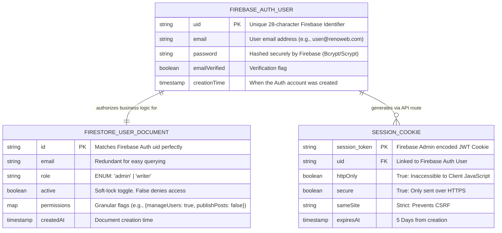
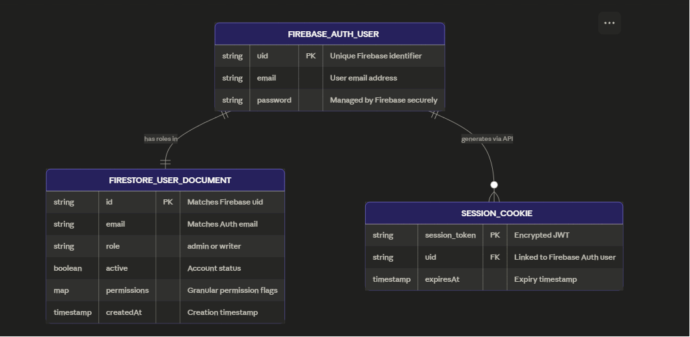
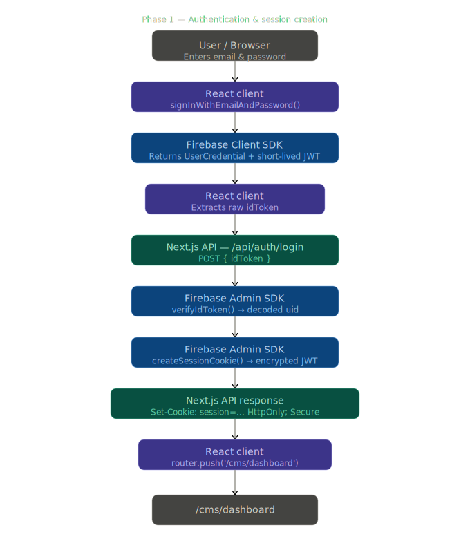
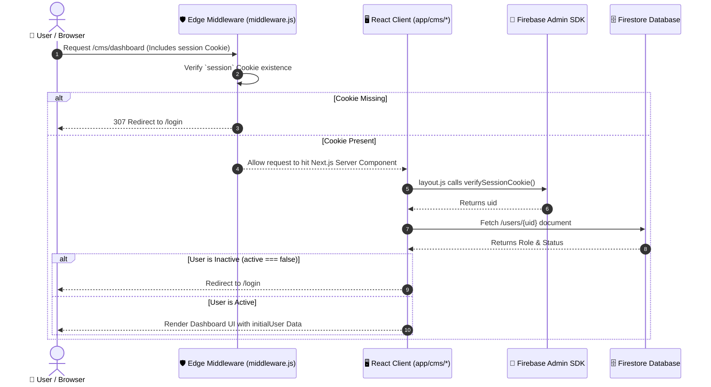
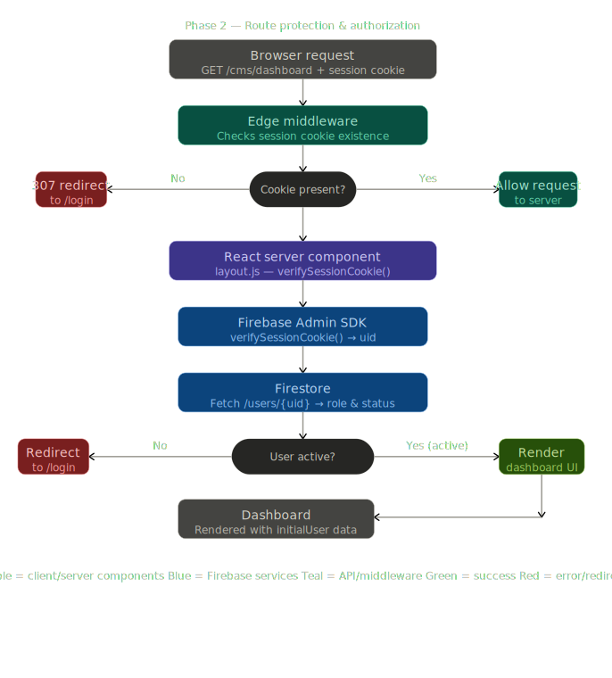

# 🔐 Renoweb CMS Authentication & Authorization Architecture

Welcome to the **Renoweb CMS Authentication Architecture** documentation. This comprehensive guide serves as the single source of truth for the secure, session-based authentication flow that protects the CMS platform. 

This system relies on a hybrid approach, combining **Firebase Authentication** (Client-side for credential validation), **Firebase Admin SDK** (Server-side for JWT verification and manipulation), and **Next.js Edge Middleware** (for instantaneous route protection using secure `httpOnly` cookies). 

By reading this guide, you will understand how we ensure that only authorized Renoweb personnel can access sensitive CMS features, preventing both unauthorized access and Cross-Site Scripting (XSS) session hijacking.

---

## 🏗 Entity-Relationship (ER) Diagram

The authentication system requires two distinct database ecosystems to function together. Firebase Auth handles the actual credentials (passwords, JWTs), while Firestore handles the business logic (roles, custom permissions, status).



<br/>



### Entity Descriptions:
1. **`FIREBASE_AUTH_USER`**: The core authentication identity. Managed entirely by Google. We never store raw passwords.
2. **`FIRESTORE_USER_DOCUMENT`**: Resides in the `/users` collection. This dictates *what* an authenticated user is allowed to do. If a user exists in Auth but has no Firestore document, they are denied access.
3. **`SESSION_COOKIE`**: The browser's proof of authentication. It is generated by the server and sent back to the client.

---

## 🔄 Data Flow Diagrams (DFD)

This section maps out the exact sequence of events divided into two distinct phases: Session Creation and Route Protection.

### Phase 1: Authentication & Session Creation

```mermaid
sequenceDiagram
    autonumber
    
    actor User as 👤 User / Browser
    participant ClientUI as 🖥️ React Client (app/login)
    participant FirebaseClient as 🌐 Firebase Client SDK
    participant API as ⚙️ Next.js Backend (/api/auth)
    participant AdminSDK as 🔐 Firebase Admin SDK
    participant Firestore as 🗄️ Firestore Database

    %% Login Flow
    User->>ClientUI: Enters Email & Password
    ClientUI->>FirebaseClient: signInWithEmailAndPassword()
    FirebaseClient-->>ClientUI: Returns UserCredential & Short-Lived JWT
    ClientUI->>ClientUI: Extract raw `idToken`
    ClientUI->>API: POST /api/auth/login { idToken }
    API->>AdminSDK: verifyIdToken(idToken)
    AdminSDK-->>API: Returns decoded decodedToken (uid)
    API->>AdminSDK: createSessionCookie(idToken, { expiresIn: 5 Days })
    AdminSDK-->>API: Returns encrypted session JWT string
    API->>User: Set-Cookie: session=XYZ; HttpOnly; Secure; SameSite=Strict
    API-->>ClientUI: 200 OK Response
    ClientUI->>ClientUI: router.push('/cms/dashboard')
```

<br/>



---

### Phase 2: Route Protection & Authorization



<br/>



### Detailed Flow Explanation:
*   **Step 2-3:** We use Firebase Client SDK because it handles complex password hashing, rate limiting, and brute-force protection out of the box.
*   **Step 8:** The resulting `session` cookie replaces the traditional `localStorage` token. This is the crux of our security model.
*   **Step 12-13:** `middleware.js` runs on Vercel's Edge Network globally. It checks for the cookie's presence *before* the server spins up Node.js resources to render the page. This prevents DDoS attacks on protected routes.
*   **Step 17-21:** The Layout component (`app/cms/layout.js`) acts as the final gatekeeper. Even if a user has a valid cookie, if an Admin toggles their `active` status to `false` in Firestore, this step will catch it and kick them out immediately upon page refresh.

---

## 📂 File Structure & Pathnames

Understanding where code lives is critical. Here is the master list of files related to the authentication ecosystem and their specific responsibilities.

| File Path | Architecture Layer | Detailed Responsibility |
| :--- | :--- | :--- |
| `middleware.js` | **Network / Edge** | The Edge runtime gatekeeper. Uses Next.js `NextRequest.cookies` to instantly redirect unauthenticated users away from `/cms/*`. |
| `lib/firebase-admin.js` | **Backend Core** | Initializes `firebase-admin` using the encrypted `FIREBASE_SERVICE_ACCOUNT_KEY` from `.env`. Uses a singleton pattern to prevent dev-server crashes. |
| `lib/AuthContext.js` | **Frontend State** | React Context Provider (`useAuth`). Bridges the gap between server-side session data and client-side UI rendering. Tracks `authReady` status to prevent race conditions with Firestore rules. |
| `lib/auth-utils.js` | **Utilities** | Shared constants mapping `ROLES` (`admin` vs `writer`) and `DEFAULT_PERMISSIONS`. Contains the `isAdmin()` helper function used across the app. |
| `app/login/page.js` | **Frontend UI** | The public-facing glassmorphism login UI. Captures credentials, interacts with Firebase Client SDK, and dispatches the token to the login API. |
| `app/api/auth/login/route.js` | **Backend API** | Converts a short-lived Firebase Client JWT into a 5-day secure `httpOnly` session cookie using `adminAuth.createSessionCookie()`. |
| `app/api/auth/logout/route.js` | **Backend API** | Destroys the `httpOnly` session cookie by setting its expiration date to the past. |
| `app/api/auth/users/create/route.js` | **Backend API** | Secure endpoint. Verifies the requester is an Admin, then uses Admin SDK to bypass client restrictions to create a new user in Auth and Firestore simultaneously. |
| `app/api/auth/users/delete/route.js` | **Backend API** | Secure endpoint. Verifies Admin status, then executes a hard-delete of the target user from both Firebase Auth and the Firestore `users` collection. Prevents self-deletion. |
| `app/cms/layout.js` | **Server Component** | Wraps the entire CMS. Explicitly uses `adminAuth.verifySessionCookie()` and fetches the Firestore user document on *every* server-side page load. |
| `app/cms/users/page.js` | **Frontend UI** | The User Management dashboard. Restricted to Admins. Interfaces with the `create` and `delete` API routes, and reads the `users` collection via Client SDK. |

---

## 🛡 Cybersecurity Safeguards

We applied multiple layers of enterprise-grade cybersecurity practices to protect the platform.

### 1. Zero Client-Side Token Storage (XSS Protection)
> [!CAUTION]
> We specifically do **NOT** use `localStorage` or `sessionStorage` for tokens. 
> 
> By utilizing `httpOnly` secure cookies generated at login, we ensure that malicious JavaScript injected into the application (Cross-Site Scripting) cannot read or steal the session token. The browser handles sending the cookie automatically on subsequent requests.

### 2. Edge Network Protection (DDoS & Performance)
> [!IMPORTANT]
> The `middleware.js` runs on the Vercel Edge. This means unauthorized requests to the CMS are blocked at the CDN level, physically close to the user, before they ever reach our Node.js application server. This saves server bandwidth and prevents server-side rendering exploits.

### 3. Strict Firestore Security Rules
> [!TIP]
> We implemented strict backend rules in Firebase Console enforcing Role-Based Access Control (RBAC). 
> 
> ```javascript
> function isAdmin() {
>   return request.auth != null && 
>          get(/databases/$(database)/documents/users/$(request.auth.uid)).data.role == 'admin';
> }
> ```
> This guarantees that even if a hacker manipulates the React frontend code to bypass the `if (!hasAccess)` checks, the Firestore database will forcefully reject their `read` or `write` requests.

### 4. API Route Privilege Verification
> [!WARNING]
> Our sensitive API endpoints (`/api/auth/users/create` and `/delete`) **never trust the frontend**. 
> 
> When a request is made, the backend independently reads the `session` cookie, decrypts the `uid`, and queries Firestore on the server-side to confirm the requester's `role` is `admin` and `active` is `true` before executing any destructive operations.

---

## ⚠️ Cautions & "Do Not Touch" Zones

If you are modifying this architecture, tread extremely carefully in these critical zones to prevent catastrophic failures or security breaches:

1. **`.env` Service Account Keys**: 
   - **DO NOT** prefix `FIREBASE_SERVICE_ACCOUNT_KEY` with `NEXT_PUBLIC_`. 
   - Doing so will bundle your highly-classified private server keys into the client-side JavaScript, giving anyone full administrative access to your entire Firebase project.
2. **`middleware.js` Configuration**: 
   - The `matcher` array inside the middleware determines what routes are protected. 
   - Do not remove `'/cms/:path*'` or your entire dashboard will instantly become publicly accessible to anyone on the internet.
3. **Auth Context Hydration (`authReady`)**: 
   - In `AuthContext.js`, we merge server-side `initialUser` data with the client-side Firebase initialization. 
   - The `authReady` flag ensures that client-side Firestore queries wait until the Firebase Auth SDK has successfully pulled the session from IndexedDB. 
   - Breaking the `authReady` dependency will cause random `FirebaseError: Missing or insufficient permissions` errors because queries will fire before Firebase finishes waking up.
4. **JSON Formatting in `.env`**:
   - Next.js `dotenv` struggles with multi-line JSON values. 
   - The `FIREBASE_SERVICE_ACCOUNT_KEY` must be formatted as a **single-line string enclosed in single quotes** (`'{"type": "service_account", ...}'`). 
   - If you update the key, you must use a script or carefully format it, otherwise `JSON.parse()` will throw a `SyntaxError` and the server will crash on startup.

---

## 🚀 Onboarding for New Developers

Welcome to the team! To get this authentication flow working on your local machine, follow these exact steps to avoid common pitfalls:

### Step 1: Environment Setup
1. Obtain the `.env` file securely from the lead developer. 
2. Ensure it contains the standard `NEXT_PUBLIC_FIREBASE_*` keys for the client.
3. Ensure it contains the flattened JSON string for `FIREBASE_SERVICE_ACCOUNT_KEY`.

### Step 2: Install Dependencies
Run `npm install` to ensure the required packages are present:
*   `firebase` (Client SDK)
*   `firebase-admin` (Server SDK)
*   `js-cookie` (For client-side cookie manipulation during testing/logout)

### Step 3: Understand the Two SDKs (Crucial!)
You will encounter errors if you mix these up:
*   **Frontend Components (`'use client'`):** Use `import { app, db } from '@/lib/firebase'`.
*   **Backend Components (`'use server'`, APIs, Middleware):** Use `import { adminAuth, adminDb } from '@/lib/firebase-admin'`. 
*   *Never import `firebase-admin` into a client component, as it relies on Node.js core modules (`fs`, `crypto`) that don't exist in the browser.*

### Step 4: Verify Firestore Rules
Ensure your local Firebase Emulator or cloud project has the strict rules applied as defined in our setup. 
*   Admins can read/write the entire `users` collection.
*   Standard Users (Writers) can only read their own specific document.

### Step 5: Testing Best Practices
*   **Always test authentication flows in an Incognito/Private window** to prevent stale cookies from confusing your local state.
*   If you change the `.env` file, you **must restart the Next.js development server** (`Ctrl+C` -> `npm run dev`) for the changes to take effect. Hot-reloading does not apply to `.env` modifications.

### Step 6: Common Errors & Troubleshooting
*   **`auth/operation-not-allowed`**: You forgot to enable the "Email/Password" sign-in provider in the Firebase Console under Authentication Settings.
*   **`SyntaxError: Expected property name or '}' in JSON at position 1`**: Your `.env` service account key is formatted with line breaks. It must be flattened into one line and wrapped in single quotes.
*   **`FirebaseError: Missing or insufficient permissions`**: 
    1. Check if the user's role in Firestore is actually `admin`.
    2. Check if the `useEffect` running the query is correctly waiting for the `authReady` flag to turn `true`.
