# 🧠 Renoweb CMS – Case Studies System

A modern CMS for creating, managing, and publishing case studies with:

- 📦 **Firebase Realtime Database** → structured content storage
- 🖼️ **Supabase Storage** → image hosting & CDN delivery
- ⚡ **React (Next.js)** → dynamic UI & live preview

---

# 🛠️ Developer Setup & Onboarding

## 1. Environment Variables (Doppler)
We use [Doppler](https://www.doppler.com/) to manage our environment variables. Transferring `.env` files manually over Slack or email is a hassle and a massive security risk. Doppler acts as a centralized, encrypted vault for our secrets.

**To set up your local environment:**
1. Install the Doppler CLI: `brew install dopplerhq/cli/doppler` (Mac) or `scoop install doppler` (Windows)
2. Authenticate your machine: `doppler login`
3. Link your local project: `doppler setup`
4. Run the development server using Doppler to securely inject the variables into Next.js:
   ```bash
   doppler run -- npm run dev
   ```
*(Do not create local `.env` files containing production or sensitive service account keys).*

---

## 2. Authentication Architecture
Before touching any code related to login, user management, or the CMS dashboard, you **must** understand how our security layers work.

👉 **[Read the Auth.md Guide Here](./Auth.md)**

It contains critical, required reading regarding:
* Our hybrid Client/Admin Firebase SDK architecture.
* The Next.js Edge Middleware protecting our routes via `httpOnly` cookies.
* How to safely use the `useAuth` hook and the `authReady` hydration flag.
* Cybersecurity safeguards preventing XSS and unauthorized access.

---

# 🏗️ Architecture Overview

```
User Input (CMS Form)
        ↓
Image Upload → Supabase Storage (Bucket)
        ↓
Get Public URL
        ↓
Combine with Form Data
        ↓
Save to Firebase Realtime DB
        ↓
Frontend fetches & renders case studies
```

---

# 📦 Why This Stack?

## 🔥 Firebase Realtime Database (Data Layer)

We use Firebase Realtime DB for:

- ⚡ **Ultra-fast reads/writes**
- 📄 Simple JSON structure
- 🔄 Real-time updates (future scalability)
- 💰 Free tier friendly

### Stored Data Example:

```json
{
  "case-studies": {
    "saas-growth-case": {
      "title": "How we scaled...",
      "category": "Lead Gen",
      "bannerUrl": "https://supabase-url...",
      "author": { "id": "gourab", "name": "Gourab Majumder" }
    }
  }
}
```

---

## 🖼️ Supabase Storage (Image Layer)

We use Supabase instead of Firebase Storage because:

- 🚫 No billing required initially
- 🌍 Global CDN delivery
- 🔗 Direct public URLs
- 🧩 Simpler integration

---

# 🖼️ Rich Text Image Handling (Deferred Sync)

To ensure high performance, zero orphaned files, and safe "Cancel" operations, the CMS uses a **Deferred Synchronization** architecture for images inserted via the Rich Text Editor.

### 🧠 The Logic
1.  **Instant Preview (`blob:`)**: When an image is inserted, it is NOT uploaded to Supabase immediately. Instead, we generate a local browser-memory URL (`URL.createObjectURL(file)`). This provides an instant, lag-free experience for the user.
2.  **Deferred Upload**: The actual upload only occurs when the user clicks **Publish** or **Save Changes**.
3.  **Automatic HTML Swapping**: During the save process, the service layer (`lib/blogs.js` or `lib/research.js`) parses the HTML, fetches the raw data from the `blob:` URLs, uploads them to Supabase, and replaces the local URLs with the public Supabase URLs in the final HTML string.
4.  **Smart Cleanup (Diffing)**: If an entry is updated, the system compares the Supabase URLs in the *old* content vs. the *new* content. Any image removed from the editor is automatically deleted from Supabase Storage to prevent space leaks.
5.  **Safe Cancellation**: If a user uploads an image and then closes the tab or clicks cancel, no network request is ever sent to Supabase, keeping the storage bucket clean.

### 🏗️ Architecture Diagram


---

## ❓ Why NOT Firebase Storage?

Firebase Storage:

- Requires **Blaze plan (billing)**
- More complex rules setup
- Overkill for simple CMS

👉 Supabase is **lighter + faster to ship**

---

# 📁 Image Storage Structure

Bucket name:

```
contentimages
```

Folder structure:

```
contentimages/
  case-studies/
    saas-growth-case.webp
    ecommerce-case.jpg
```

---

## 🧠 Image Upload Flow

1. User selects image
2. File is uploaded to Supabase:

   ```js
   supabase.storage.from("contentimages").upload(...)
   ```

3. Public URL is generated:

   ```js
   getPublicUrl(fileName);
   ```

4. URL is saved in Firebase DB

---

## 🔗 Example Public URL

```
https://PROJECT_ID.supabase.co/storage/v1/object/public/contentimages/case-studies/slug.jpg
```

---

# 🧩 Component Architecture

## 📍 Main Page (`page.js`)

Handles:

- Global state
- Form submission
- Firebase + Supabase integration

---

## 🧾 Components Breakdown

### 1. `CaseStudyForm`

- Handles all inputs:
  - Title
  - Category
  - Challenges
  - Solutions

- Auto-generates slug

---

### 2. `BannerUploader`

- Drag & drop image upload
- Generates preview (base64)
- Stores `bannerFile` in state

---

### 3. `SidebarPreview`

- Live card preview
- Completion checklist
- Publish button trigger

---

### 4. `JsonModal`

- Shows final structured JSON
- Debugging & export tool

---

### 5. `AuthorSelector`

- Select primary + co-author
- Uses predefined author constants

---

### 6. `CMSNavbar`

- Navigation between sections
- Save status indicator

---

# 🔄 Data Flow (Step-by-Step)

```
[User fills form]
        ↓
[BannerUploader stores file]
        ↓
[handleSave triggered]
        ↓
[Validation runs]
        ↓
[Slug uniqueness check (Firebase)]
        ↓
[Upload image → Supabase]
        ↓
[Get public URL]
        ↓
[Build payload]
        ↓
[Save to Firebase]
        ↓
[Success state]
```

---

# 🔐 Security

## Firebase Rules

```json
{
  "rules": {
    "case-studies": {
      ".read": true,
      ".write": true
    }
  }
}
```

> ⚠️ Open for development. Restrict in production.

---

## Supabase Policies

### Upload:

```sql
bucket_id = 'contentimages'
```

### Read:

```sql
bucket_id = 'contentimages'
```

---

# ⚠️ Important Notes

### 1. Bucket Name Consistency

Must match everywhere:

```js
.from("contentimages")
```

---

### 2. Public Bucket Required

Supabase bucket must be:

```
Public = true
```

---

### 3. Slug Safety

Slug is used as:

```
Firebase key + image filename
```

Must NOT contain:

```
. # $ [ ]
```

---

# 🚀 Future Improvements

- ✏️ Edit existing case studies
- 🗑️ Delete case + image
- 🧠 Auto image compression
- ✅ Auth-based CMS access (Completed)
- 📊 Analytics dashboard

---

# 💯 Final Summary

| Layer | Tool             | Purpose            |
| ----- | ---------------- | ------------------ |
| UI    | React (Next.js)  | CMS interface      |
| Data  | Firebase RTDB    | Structured content |
| Media | Supabase Storage | Image hosting      |

---

# 🧠 Philosophy

> Use the **right tool for the right job**

- Firebase → fast structured data
- Supabase → simple, scalable media delivery

---

# 🏁 Status

✅ Fully functional CMS
✅ Production-ready (with minor security upgrades needed)
✅ No paid dependencies required

---

Made with ⚡ by Renoweb
